# Active Directory Home Lab

This project documents the deployment and administration of a Windows Server 2022 Active Directory lab built in VMware Workstation.

The environment simulates a small business network and demonstrates core Windows administration tasks including Active Directory, Organizational Units, security groups, NTFS permissions, SMB file sharing, Group Policy, mapped network drives, and domain security policies.

## Overview

The goal of this lab was to gain practical experience administering a Windows domain in a controlled environment.

Starting with a clean Windows Server installation, I promoted the server to a Domain Controller, configured Active Directory and DNS, created Organizational Units and security groups, deployed departmental file shares, configured NTFS permissions, mapped network drives through Group Policy Preferences, and verified policy deployment from a Windows 11 workstation.

Throughout the project I also troubleshot Active Directory, DNS, Group Policy, and networking issues that commonly occur in real Windows environments.

## Objectives

- Build a Windows Server 2022 Active Directory domain
- Join a Windows 11 workstation to the domain
- Organize users and computers into Organizational Units (OUs)
- Create security groups for department-based access
- Configure SMB network shares
- Apply NTFS permissions using the principle of least privilege
- Deploy mapped network drives using Group Policy Preferences
- Verify Group Policy deployment with GPResult
- Configure a domain password policy

## Technologies Used

- Active Directory Domain Services (AD DS)
- Group Policy Management
- NTFS Permissions
- SMB File Sharing
- VMware Workstation
- Windows 11 Enterprise
- Windows Server 2022

## Environment

| Component | Configuration |
|-----------|---------------|
| Hypervisor | VMware Workstation |
| Domain Controller | Windows Server 2022 |
| Client | Windows 11 Enterprise |
| Domain | rossi.local |
| Departments | IT, HR, Sales |

## Lab Architecture

The lab consists of one Windows Server 2022 Domain Controller and one Windows 11 Enterprise client running as virtual machines in VMware Workstation.

The Domain Controller hosts:

- Active Directory Domain Services (AD DS)
- DNS
- Group Policy Management
- SMB File Shares

The Windows 11 workstation is joined to the domain and is used to verify authentication, Group Policy deployment, and access to departmental network shares.

## Implemented Features

- Installed and configured Windows Server 2022
- Promoted the server to a Domain Controller
- Created the **rossi.local** Active Directory domain
- Created Organizational Units (IT, HR, and Sales)
- Created users and assigned them to departmental security groups
- Created departmental SMB file shares
- Configured NTFS permissions using least privilege
- Joined a Windows 11 workstation to the domain
- Configured mapped network drives using Group Policy Preferences
- Verified Group Policy deployment with GPResult
- Configured a domain password policy

## Implementation

### 1. Lab Overview

The lab was built in VMware Workstation using a Windows Server 2022 Domain Controller and a Windows 11 Enterprise client. The environment is isolated from the host network, making it easy to test configuration changes without affecting other devices.

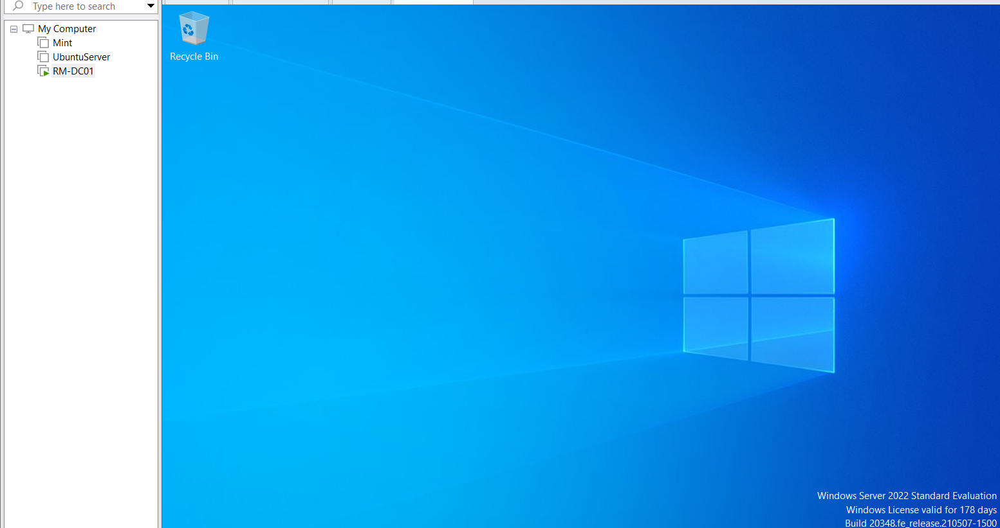

### 2. Organizational Units

Departmental Organizational Units (IT, HR, and Sales) were created beneath the Employees OU to organize user accounts and simplify administration. This structure also makes it easier to target Group Policy Objects to specific users.

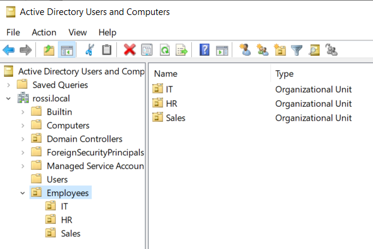

### 3. Managed Workstations

A dedicated Organizational Unit was created for domain-joined computers. Separating computer accounts from user accounts provides a cleaner Active Directory structure and allows computer-specific policies to be applied later.

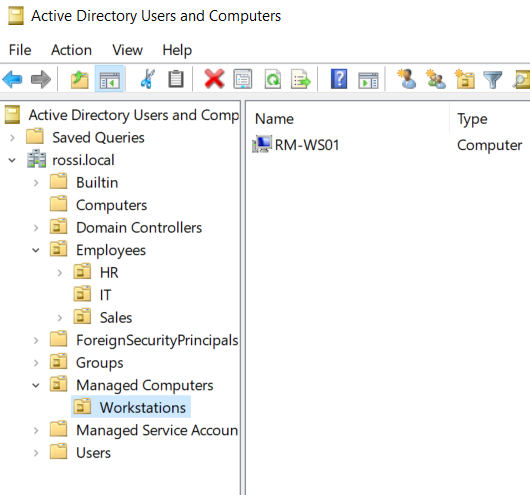

### 4. Domain Authentication

The Windows 11 workstation was successfully joined to the **rossi.local** domain, allowing users to authenticate using Active Directory credentials instead of local accounts.

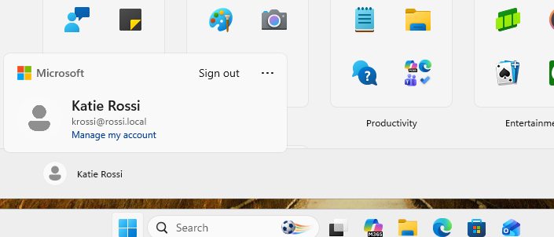

### 5. Security Groups

Departmental security groups were used to manage access to shared resources. Assigning permissions to groups instead of individual users makes administration simpler and easier to maintain as the environment grows.

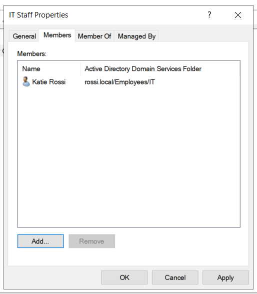

### 6. Department File Shares

Separate file shares were created for each department to simulate a small business file server. This structure provides centralized storage while allowing each department to have its own permissions.

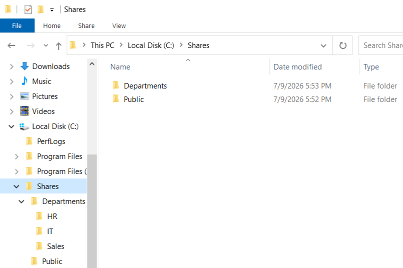

### 7. NTFS Permissions

NTFS permissions were configured using the principle of least privilege. Department security groups were granted only the permissions required to perform their jobs while administrative accounts retained Full Control.

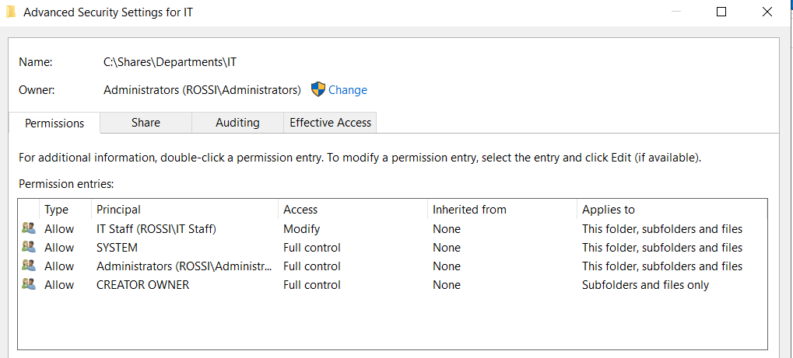

### 8. Department Network Share

The IT share contains folders for policies, procedures, software, and onboarding documentation. Access to the share is controlled through Active Directory security groups and later mapped automatically through Group Policy.

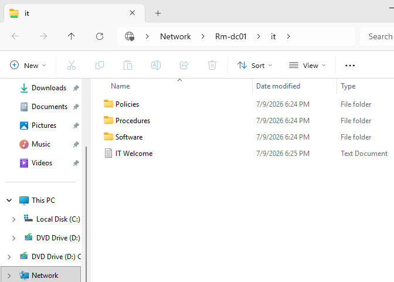

### 9. Group Policy Drive Mapping

Group Policy Preferences were used to automatically map departmental network drives during user sign-in. This eliminates the need to manually configure drive mappings on individual workstations.

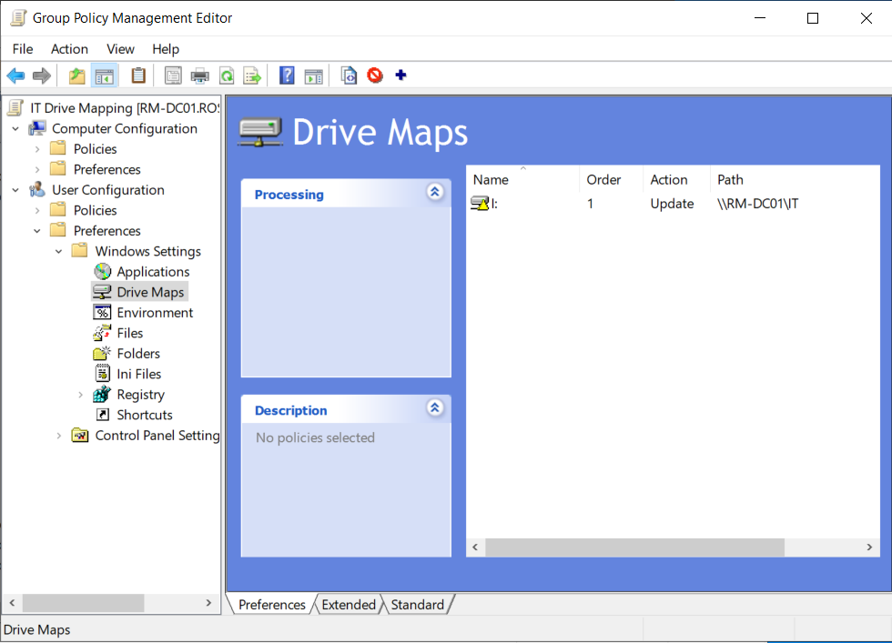

### 10. Group Policy Verification

The **GPResult** command was used on the Windows 11 workstation to verify that the Group Policy Object was successfully applied to the logged-in user, confirming that the drive mapping policy deployed as expected.

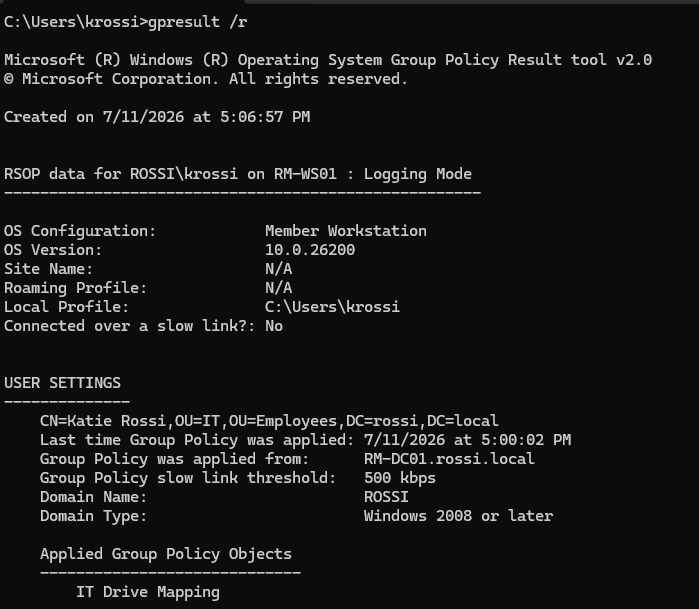

### 11. IT Drive Mapping

The IT department share was automatically mapped after Group Policy was processed, giving authorized users immediate access to departmental resources.

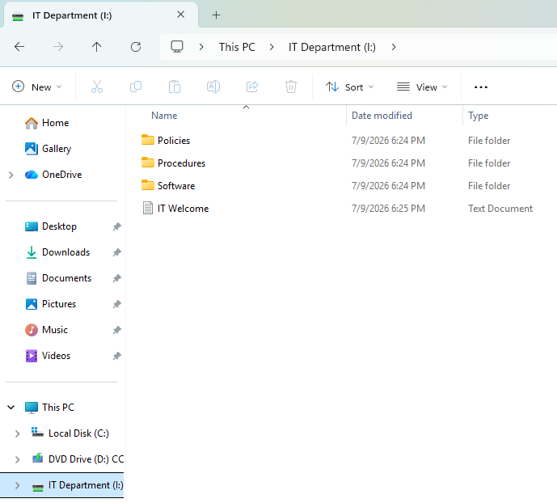

### 12. HR Drive Mapping

The HR department received its own mapped network drive through the same Group Policy process, demonstrating department-based access control.

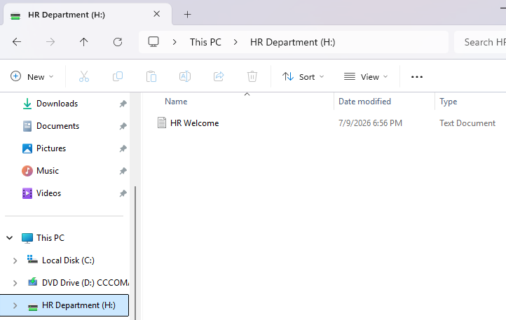

### 13. Sales Drive Mapping

The Sales department drive was mapped automatically for authorized users, providing consistent access management across all departments.

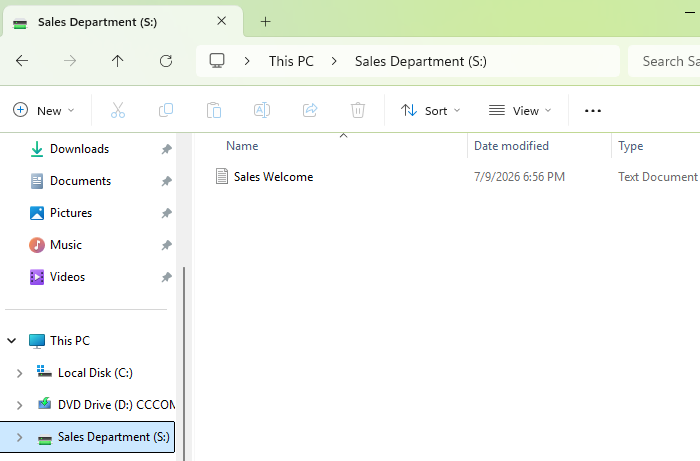

### 14. Domain Password Policy

A domain password policy was configured through Group Policy to enforce password complexity, minimum password length, password history, and password expiration requirements.

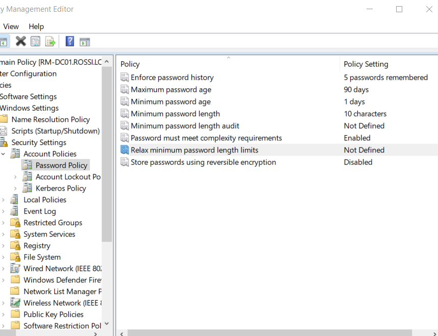

## Skills Demonstrated

- Active Directory Domain Services (AD DS)
- Windows Server Administration
- Windows Client Administration
- Organizational Unit (OU) Design
- User and Group Administration
- Security Group Management
- NTFS Permissions
- SMB File Sharing
- Group Policy Management
- Group Policy Preferences
- Network Drive Mapping
- Windows Authentication
- Password Policy Configuration
- VMware Workstation
- Troubleshooting DNS, Group Policy, and NTFS Permissions

## Lessons Learned

This project reinforced the importance of organizing Active Directory resources using Organizational Units and security groups rather than assigning permissions directly to individual users. I also gained practical experience configuring NTFS permissions, deploying Group Policy Preferences, verifying policy application with GPResult, and troubleshooting domain authentication, DNS, and drive mapping.

Building the environment from scratch strengthened my understanding of how Active Directory components work together to simplify administration, improve security, and make ongoing management more efficient.

## Future Improvements

This lab will continue to evolve as I expand my Windows Server and cloud administration skills.

Planned improvements include:

- Expanding the environment with Microsoft Azure
- Automating administrative tasks with PowerShell
- Bulk user and group provisioning
- Windows Event Log auditing
- Deploying DHCP and WSUS
- Adding additional client workstations

## Repository Structure

active-directory-home-lab
│
├── README.md
├── Diagrams
├── Docs
│   └── naming-conventions.md
└── Screenshots
    └── Final
    